# 🛡️ Crusader Kings 3 DNA Beautifier ⚔️  

A **dark medieval-themed** web tool for **enhancing and processing Crusader Kings 3 Persistent DNA**. This tool **makes characters look younger, slows aging, and enhances their appearance** (*beauty is subjective, but you can modify the settings to match your personal preferences*).

---

## **🌍 Live Demo**  
You can access the **public page** here:  
🔗 **[Crusader Kings 3 DNA Beautifier](https://guga06436.github.io/ck3-dna-beautifier/)**  

---

## **🖼️ Before & After Previews**  
These images show **before and after results** of using the beautifier.

<table>
  <tr>
    <td align="center">🏰 Akan</td>
    <td align="center">🏰 Arabic</td>
    <td align="center">🏰 Chinese</td>
  </tr>
  <tr>
    <td>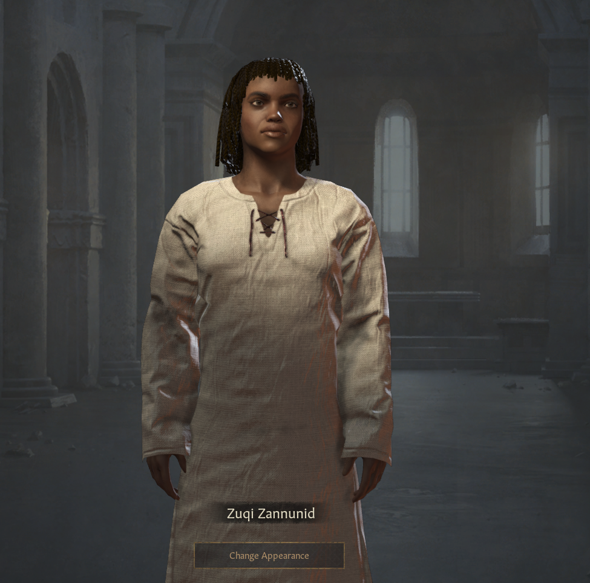 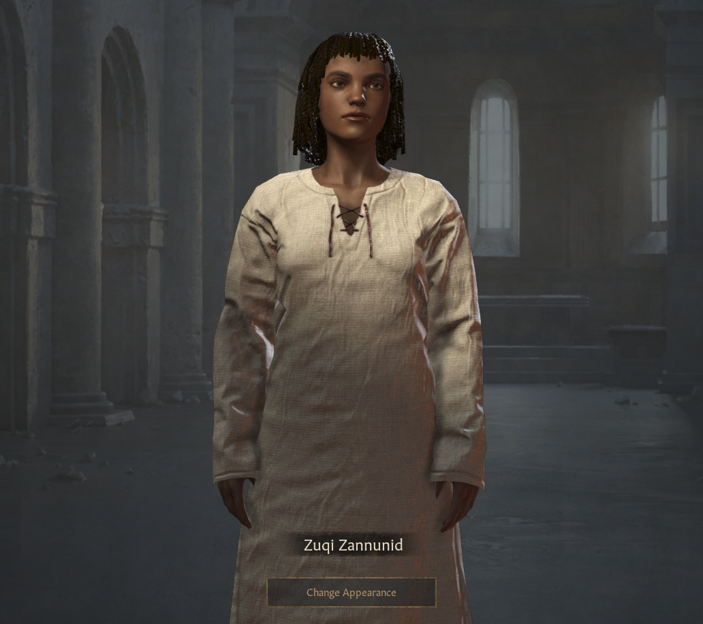</td>
    <td>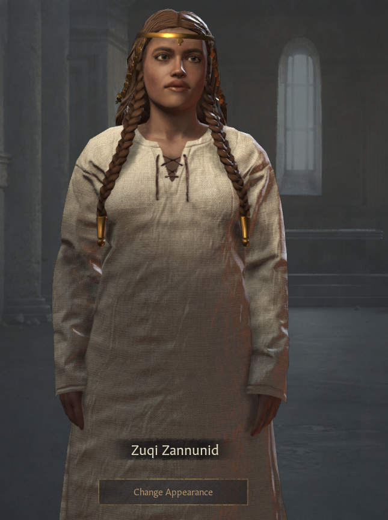 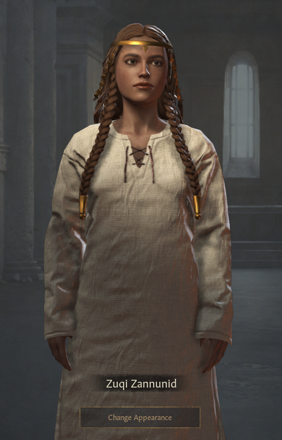</td>
    <td>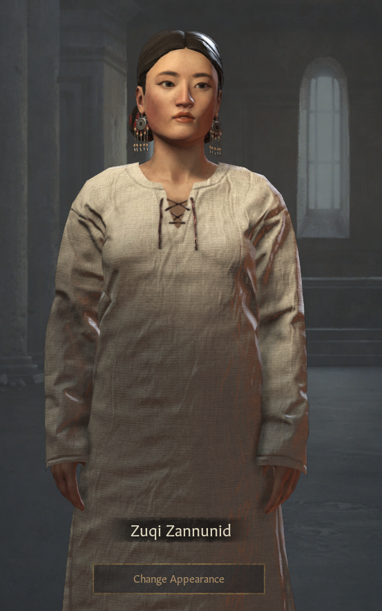 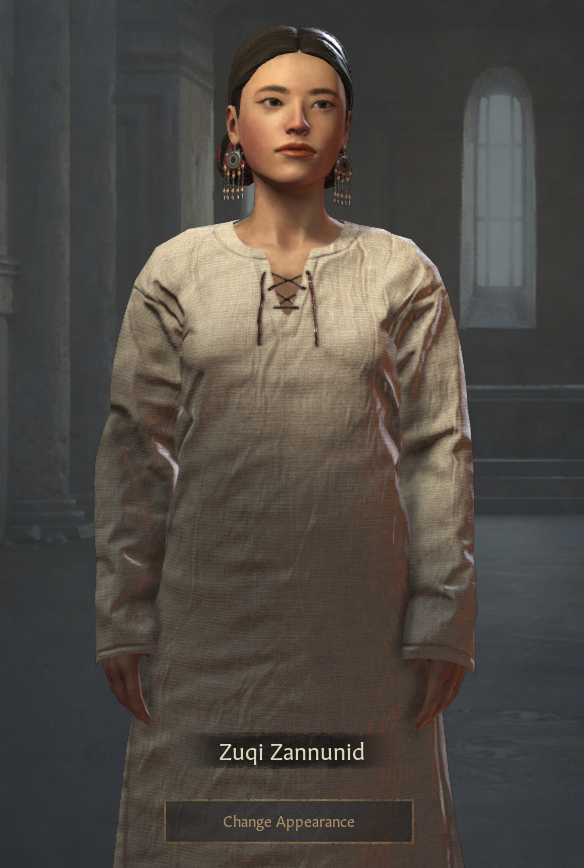</td>
  </tr>
  <tr>
    <td align="center">🏰 Dutch</td>
    <td align="center">🏰 Iberian (50 Years)</td>
    <td align="center">🏰 Persian</td>
  </tr>
  <tr>
    <td>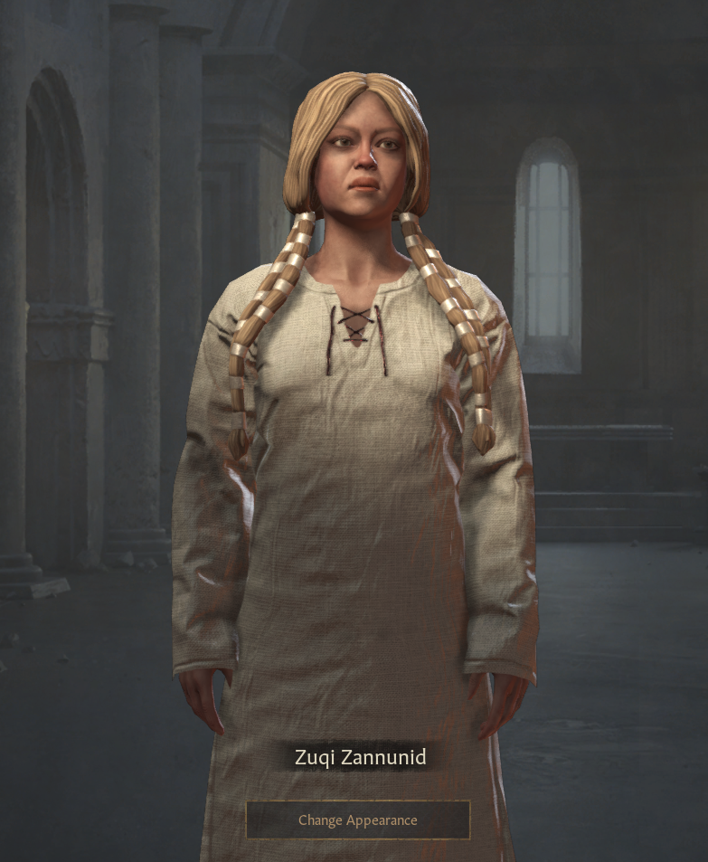 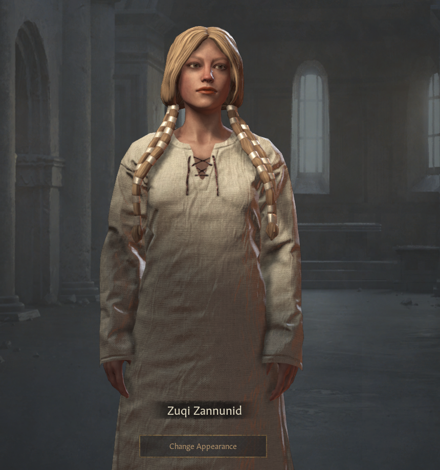</td>
    <td>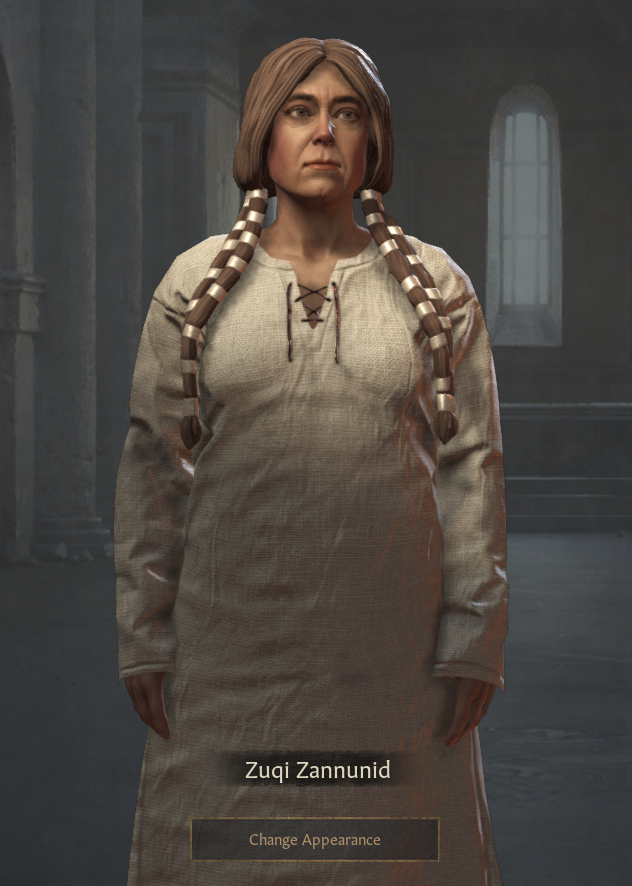 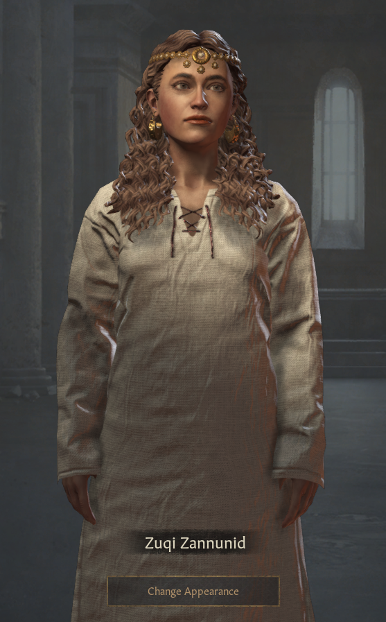</td>
    <td>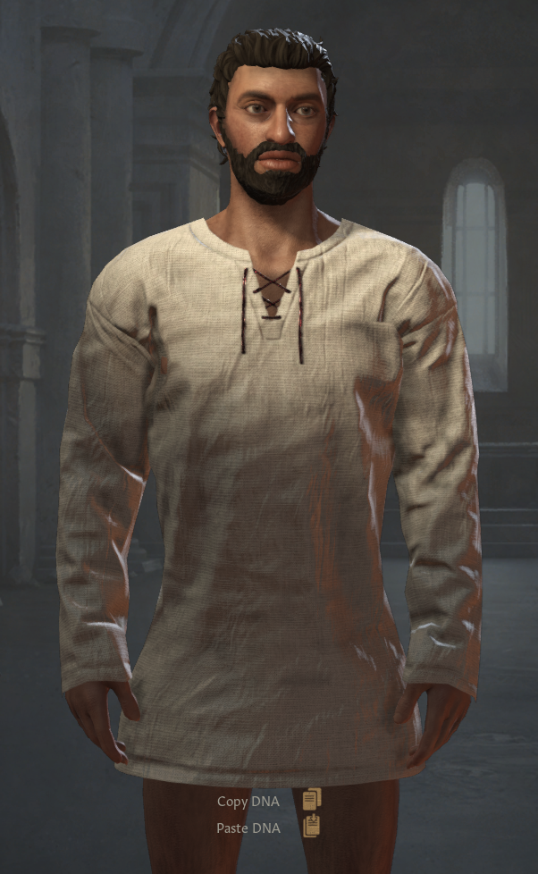 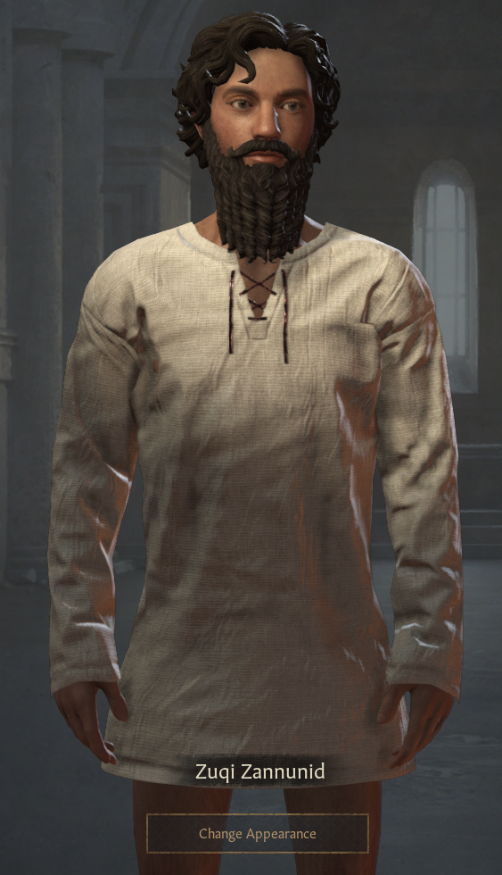</td>
  </tr>
  <tr>
    <td align="center">🏰 Tamil</td>
    <td align="center">🏰 Welsh</td>
  </tr>
  <tr>
    <td>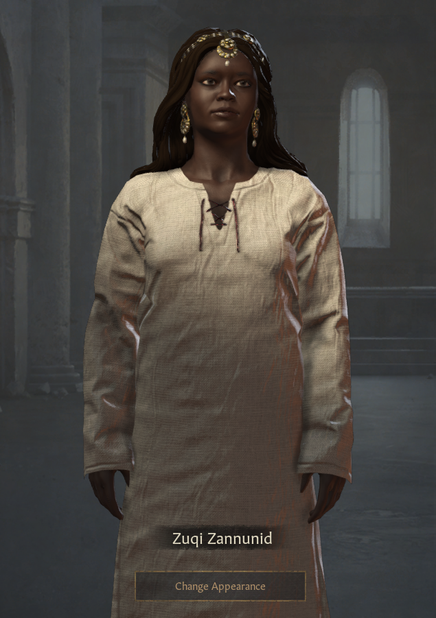 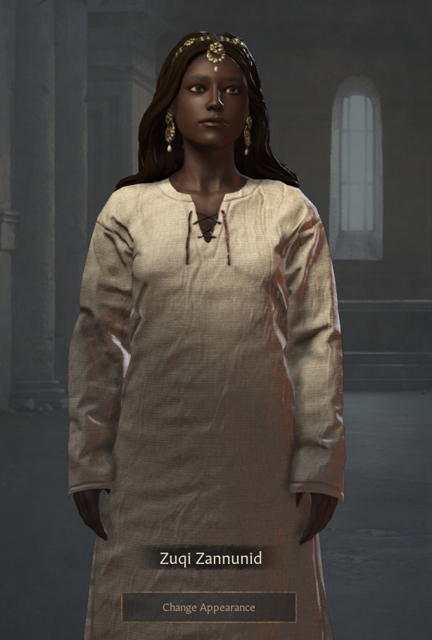</td>
    <td> 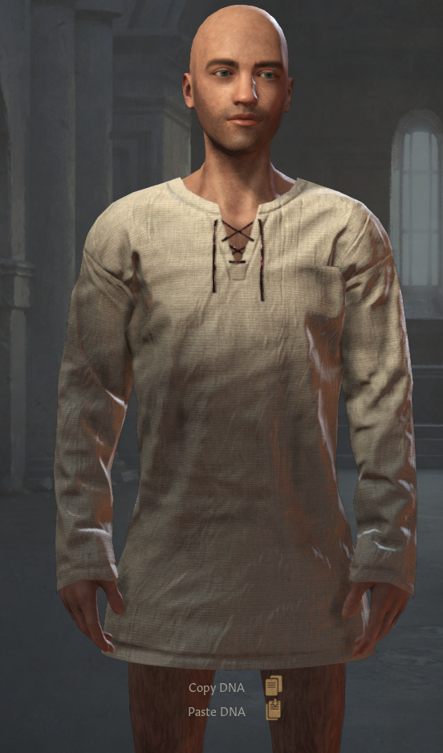</td>
  </tr>
</table>

---

## **📜 Features**
✅ **DNA Processing** - Converts CK3 DNA input into a more beautiful format.  
✅ **Clipboard Integration** - Supports **paste & copy**.  
✅ **Fast & Lightweight** - No unnecessary dependencies.  

---

## **📂 Project Structure**
```
/ck3-dna-beautifier
│── /css
│   ├── styles.css       # Main UI styles
│── /js
│   ├── main.js          # Handles UI interactions (copy, paste, process)
│───├── /Dna
│       ├── DnaConfig.js     # Stores DNA-related configuration
│       ├── DnaProcessor.js  # Processes DNA text
│── /preview              # Stores before/after images
│── index.html          # Main UI structure
│── README.md           # Documentation
```

---

## **🚀 Installation & Usage**  

### **1️⃣ Clone the Repository**  
```bash
git clone https://github.com/your-username/ck3-dna-beautifier.git
cd ck3-dna-beautifier
```

### **2️⃣ Open the `index.html` Locally**  
You can open the file `index.html` in your browser:  
```bash
open index.html   # MacOS
xdg-open index.html   # Linux
start index.html   # Windows
```

### **3️⃣ Paste & Beautify CK3 DNA**
- **Paste** your DNA string in the **input box**.
- Click **"Beautify DNA"** to process it.
- **Copy** the structured DNA output.

---

## **🛠️ Technologies Used**
- **HTML5**
- **CSS3 (Dark Medieval Themed)**
- **JavaScript (Clipboard, Text Processing)**

---

## **⚔️ License**
This project is licensed under the **MIT License**. Feel free to use, modify, and distribute it.

---

🔥 **Now you can easily edit CK3 characters like a true medieval ruler!** ⚔️  
🚀 **Happy DNA editing!** 🏰🎭  
